# Лабораторная работа №2. Облачные вычислительные сервисы. Amazon EC2

**Выполнил**

- Балев Вадим

**Группа**

- I2402

**Специальность**

- Информатика

**Уровень**

- Продвинутый

**Вариант деплоя**

- B. С помощью скрипта `deploy.sh`

**Ссылка на публичный репозиторий в организации GitHub**

- https://github.com/blackrosegarrote-cloud/timecapsule

## Цель работы

Научиться запускать и настраивать виртуальные машины Amazon EC2, подключаться к ним по SSH, диагностировать их состояние и разворачивать на них веб-приложение: от статической страницы до настоящего приложения с базой данных, которое сервер сам забирает из репозитория GitHub.

## Ход работы

### Задание 1. Подготовка аккаунта

Был выполнен вход в консоль AWS и выбран регион Europe (Frankfurt).

Создание пользователя IAM:

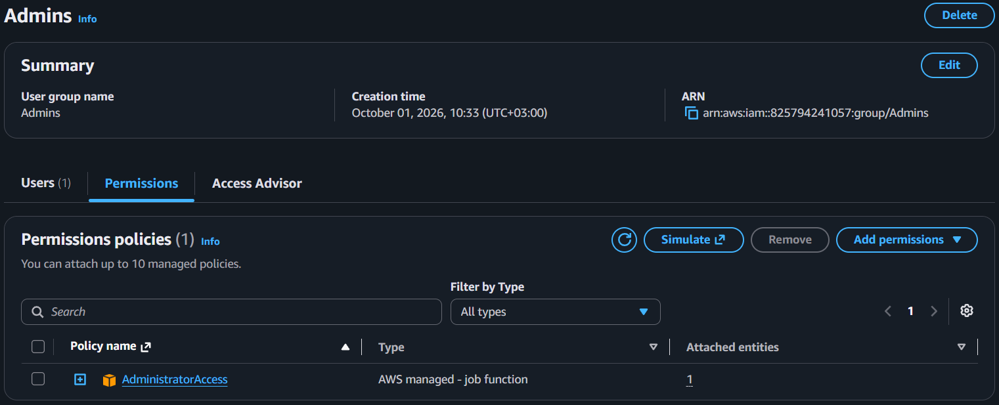

Сперва была создана группа Admins с подключенной политикой AdministratorAccess.

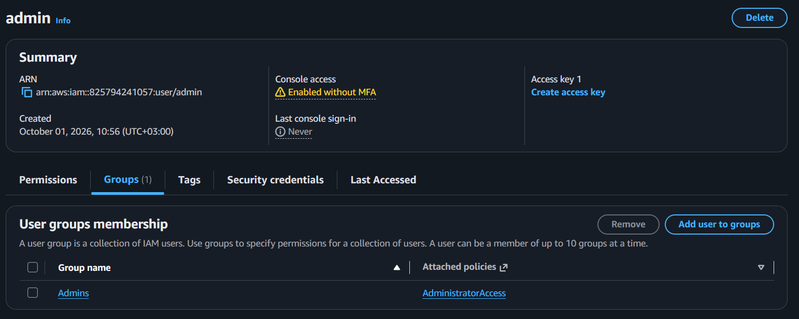

Затем был создан пользователь с доступом к консоли и добавлен в группу Admins.

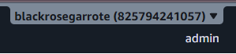

Вход с аккаунта нового пользователя.

**Вопросы**

- **Что разрешает политика AdministratorAccess?**

  - AdministratorAccess - управляемая политика AWS, которая разрешает любые действия во всех сервисах аккаунта.

- **Почему для повседневной работы нельзя использовать root?**

  - Это небезопасно: Root используется только для начальной настройки. Поскольку Root нельзя ограничить политиками и он имеет полный доступ к аккаунту, компрометация root'а приведет к полной его потере.

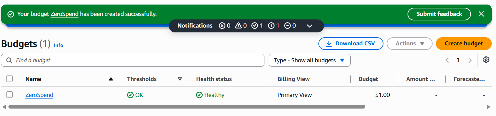

Настройка бюджета с нулевым порогом, чтобы получить письмо, как только аккаунт начнёт тратить деньги.

### Задание 2. Запуск экземпляра EC2

Для того, чтобы запустить экземпляр, как ни странно, его нужно сперва создать. 

**Процесс создания экземпляра. Заполнение параметров**

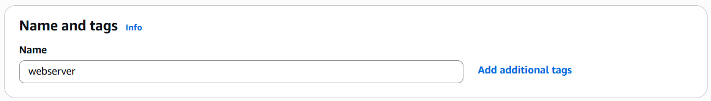

Присвоение имени экземпляра.

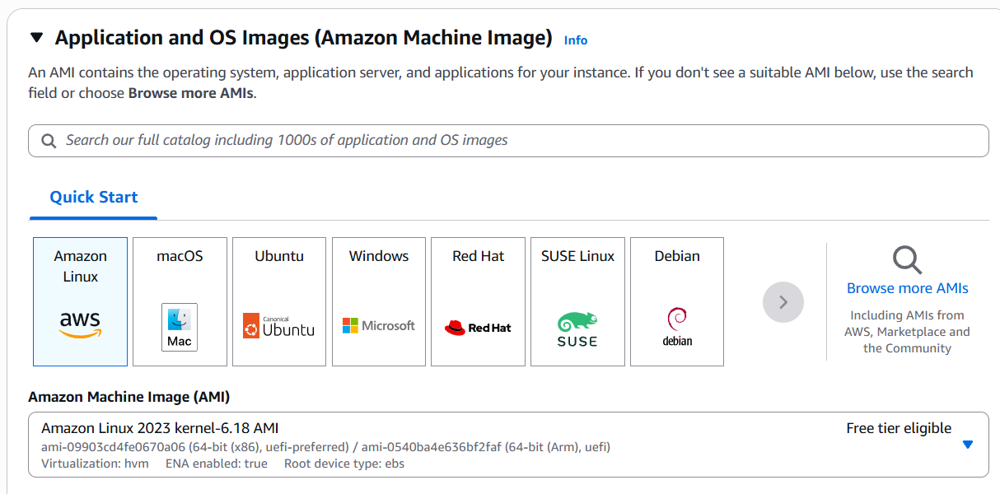

Выбор необходимого образа системы (AMI).

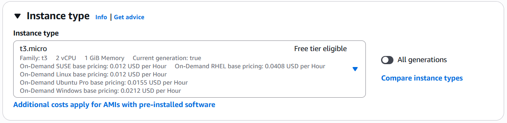

Выбор подходящего типа экземпляра.

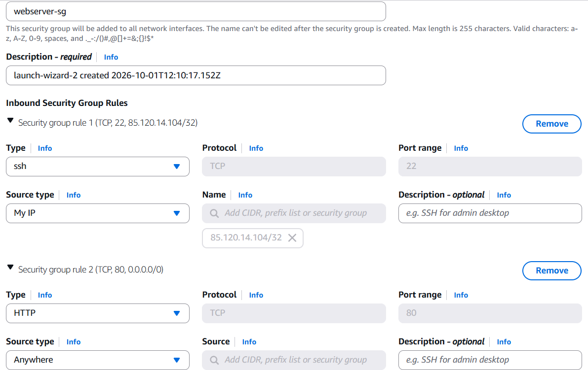

Создание key-pair для удаленного доступа к экземпляру.

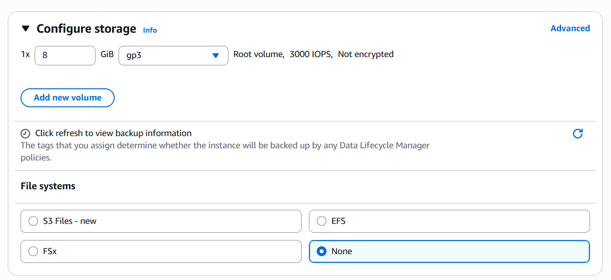

Параметры хранилища, выбраны по умолчанию.

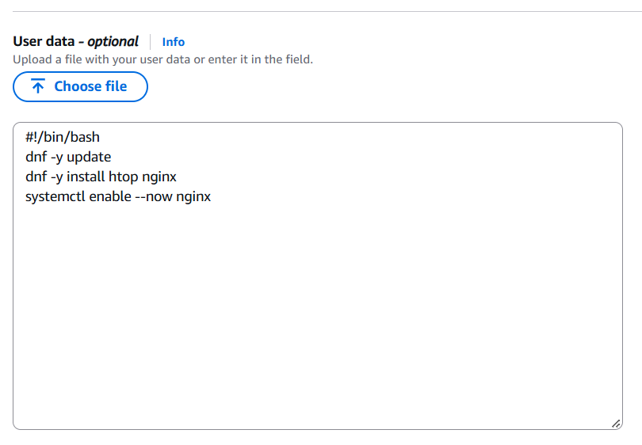

Ввод скрипта в User data.

**Вопросы**

- **Что такое User data и когда выполняется этот скрипт?**
  - User data - поле в разделе создания экземпляра, куда передается cloud-init-конфигурация или скрипт для автоматической настройки машины при первом запуске.

- **Выполнится ли он повторно после перезагрузки экземпляра?**
  - Нет, так как User data по умолчанию выполняется лишь единожды. Cloud-init запомнит обработку user data для этого экземпляра и не выполнит скрипт повторно.

### Задание 3. Мониторинг и диагностика

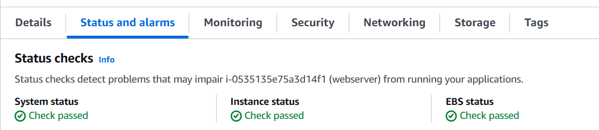

Раздел Status and alarms, в нем есть также подразделы:

- System status check проверяет инфраструктуру AWS: физический сервер и сеть, на которых работает экземпляр
- Instance status check проверяет саму виртуальную машину: загрузилась ли операционная система и отвечает ли она
- Attached EBS status check проверяет, доступны ли подключённые тома EBS

На скриншоте можно увидеть, что с этим экземпляром нет никаких проблем на данный момент.

**Вопрос**

- **Какая из проверок укажет на проблему, которую можете исправить вы, а какая на проблему на стороне AWS?**
  - Instance status check - проблема пользователя. Вероятные проблемы в этом разделе: проблемы с загрузкой ОС, хранилище переполнено, сбиты настройки сети - всё это находится в зоне ответственности пользователя и настраивается им самим, так что устранение этих проблем его забота и исправляется им же.
  - System status check - проблема на стороне AWS. Сюда входят: неисправность физического хоста, гипервизора и прочие проблемы, которые решает сам AWS, поскольку это касается их оборудования.
  - Attached EBS status check - формально, причина на стороне AWS, но рискует потерять данные пользователь. Поскольку диск относится к оборудованию AWS, пользователь не несет за него отвественность и исправляет неполадки именно AWS, но он не гарантирует сохранность данных в процессе починки диска, потому что проблемный диск может отказать в любой момент, поэтому следует сделать снимок тома, чтобы затем из него восстановить данные. Исходя из этого, проблему решает как сам пользователь, так и AWS.

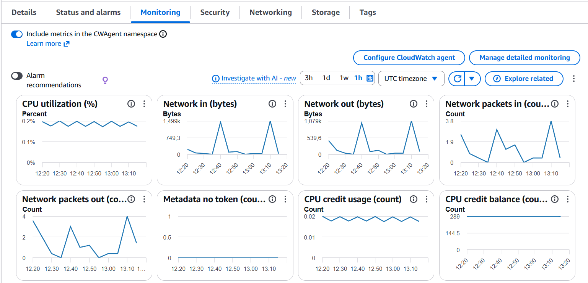

Раздел Monitoring состоит из:

- CPU utilization (%) — процент времени, в течение которого процессоры экземпляра были заняты вычислениями, значение около 0.2% означает практически полностью простаивающую машину.
- Network in (bytes) — объём данных в байтах, полученный экземпляром из сети за период измерения, редкие пики соответствуют входящим обращениям, например SSH-подключениям или HTTP-запросам.
- Network out (bytes) — объём данных в байтах, отправленный экземпляром в сеть за период, пики на графике - это ответы сервера внешним клиентам.
- Network packets in (count) — количество входящих сетевых пакетов за период, то есть интенсивность входящего трафика в штуках, а не в объёме.
- Network packets out (count) — количество исходящих сетевых пакетов за период, парная метрика к предыдущей для исходящего направления.
- Metadata no token (count) — число обращений к Instance Metadata Service без токена безопасности, то есть по устаревшему IMDSv1; ноль на графике означает, что метаданные запрашиваются только по безопасному IMDSv2 или не запрашиваются вовсе.
- CPU credit usage (count) — количество CPU-кредитов, потраченных за период на работу выше базового уровня производительности.
- CPU credit balance (count) — накопленный запас кредитов, доступных для всплесков нагрузки выше базового уровня, ровная линия около 289 говорит, что машина почти не выходит за базовую производительность и запас не тратится.

**Вопрос**

- В каких случаях стоит включать детальный мониторинг?
  - Детальный мониторинг следует влючать в период коротких и резких всплесков нагрузок, поскольку 5-минутная метрика - средний показатель за 5 минут и всплеск нагрузки длительностью в минуту просто растворится. Его следует включать так же и в периоды отладки, а еще в production-сервисах, где минута простоя из-за какой-то невыявленной вовремя ошибки будет стоить дороже, чем плата за детальную метрику.

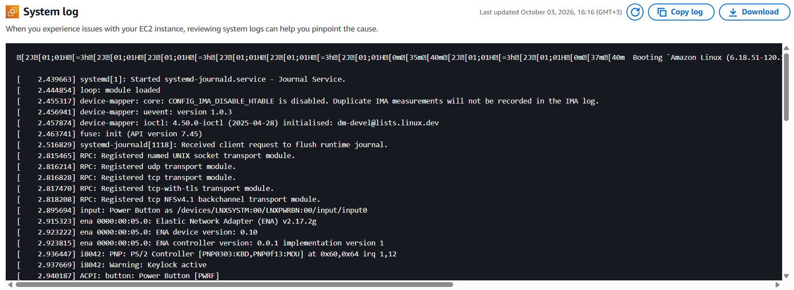

Раздел System log - это вывод консоли экземпляра. Здесь так же находилась информация об установке nginx из скрипта User data, однако в процессе выполнения работы экземпляр запускался несколько раз, а информация о выполнении User data скрипта выводится только при первом запуске, так и скрипт из User data выполняется по умолчанию только один раз при первом запуске.

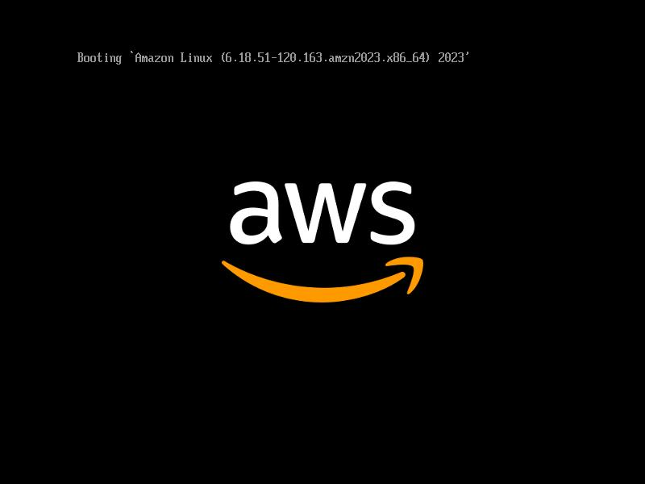

В этом разделе можно посмотреть скриншот системы, чтобы, например, узнать почему система не отвечает или загрузилась ли она вообще.

### Задание 4. Подключение по SSH

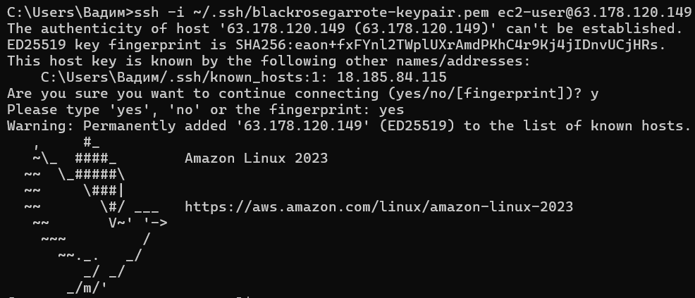

Подключение к эземпляру из домашнего пк.

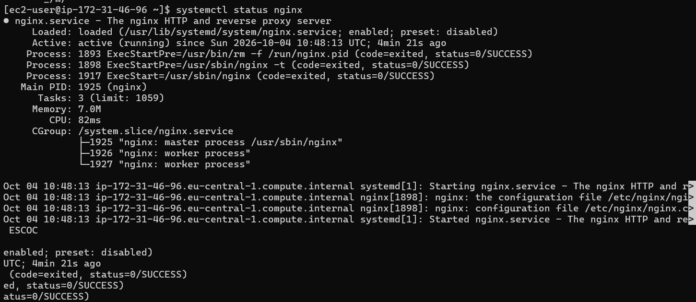

Команда systemctl status nginx показывает, в каком состоянии находится служба nginx: загружена ли она, активна ли и какие процессы запущены. В выводе видно, что служба loaded и enabled, то есть добавлена в автозагрузку, и active (running) уже 4 минуты 21 секунду, а все ExecStart-процессы завершились со статусом SUCCESS, значит nginx запустился без ошибок.

**Вопрос**

- **Почему для входа на экземпляр EC2 используется ключ, а не пароль?**
  - Пароль можно подобрать перебором или украсть, а ключ перебором не берётся. В облачных образах парольная аутентификация в sshd вообще отключена по умолчанию, что убирает целый класс атак (brute force, credential stuffing).

### Задание 5. Статический сайт

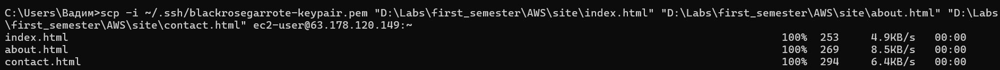

Копирование небольшого сайта на сервер с помощью `scp`.

**Вопрос**

- **Что делает команда scp и чем она похожа на ssh?**
  - `scp` (secure copy) файлы между локальной машиной и удаленным сервером по сети.
  - Она схожа с `ssh` тем, что использует тот же протокол SSH для шикфрования и тоже проходит аутентификацию по приватному ключу. Для использования `scp` нужны ровно те же условия, что и для `ssh`.

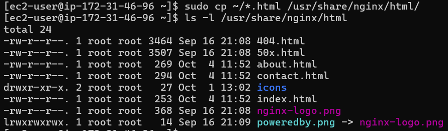

Копирование сайта в нужную папку и проверка папки на наличие файлов. Все скопировалось корректно.

**Проверка работоспособности сайта**

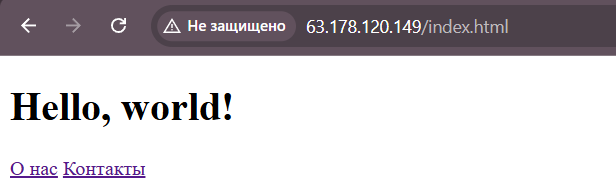

Главная страница

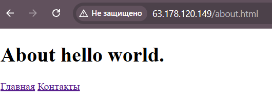

Страница "О нас"

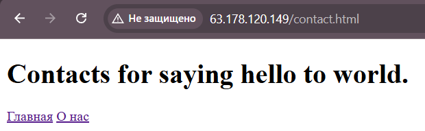

Страница "Контакты"

Проверка прошла успешно, никаких проблем с отображением страницы или навигацией между ними выявлено не было.

### Задание 6. Остановка экземпляра через AWS CLI

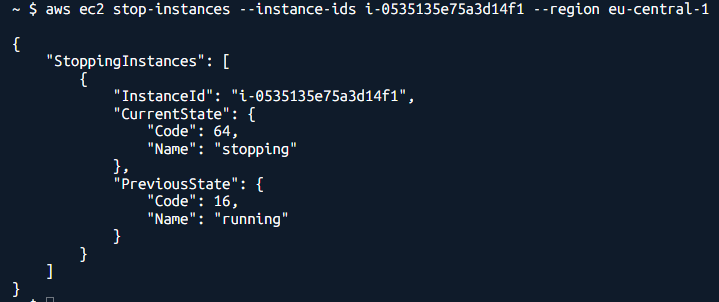

Остановка экземпляра с помощью CloudShell

**Вопросы**

- **Чем Stop отличается от Terminate?**
  - Stop только выключает экземпляр, все данные сохраняются. Операционная система останавливается, корневой и дополнительные EBS-тома остаются со всеми данными, и экземпляр можно запустить снова.  
  Terminate удаляет экземпляр безвозвратно: корневой том по умолчанию удаляется вместе с данными, запустить такой экземпляр снова нельзя.
- **За что вы продолжаете платить, пока экземпляр остановлен?**
  - После остановки экзмепляра пользователь по прежнему платит за хранилище. Дополнительно в стоимость могут входить, например, сохраненные снапшоты и Elastic IP, если таковые имеются.

### Задание 7. Организация и репозиторий на GitHub

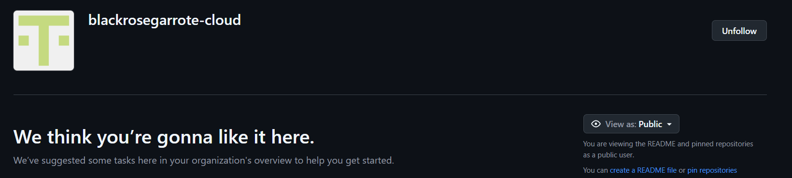

Создание организации в GitHub с Free-планом.

Загрузка код приложения в удаленный репозиторий. Для этого были введены поочередно следующие команды:

```bash
# скачиваем репозиторий с примерами приложений
git clone https://github.com/msu-cloud-course/app-samples

# папка timecapsule была создана через визуальный интерфейс Windows

# копируем содержимое примера в timecapsule, был
cp -r app-samples/open_capsules_php_functional/. timecapsule/   выбран вариант open_capsules_php_functional

# переходим в папку проекта
cd timecapsule 

# создаём git-репозиторий с веткой main
git init -b main

# индексируем все файлы проекта

# индексируем все файлы проекта
git add .

# фиксируем первый снимок проекта
git commit -m "initial import of timecapsule"

# привязываем удалённый репозиторий
git remote add origin https://github.com/blackrosegarrote-cloud/timecapsule.git

# отправляем ветку main на GitHub и связываем с ней локальную
git push -u origin main  
```

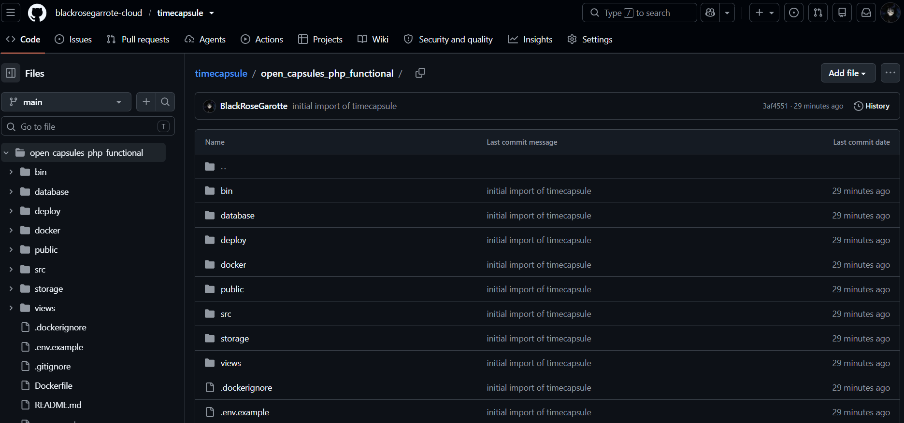

Результат выполнения всех команд: приложение появилось в нужном репозиторие, никакие файлы не потерялись.

**Вопрос**

- **Почему папка vendor/ и файл .env не попали в репозиторий?**
  - Они перечислены в `.gitignore`, поэтому git их не индексирует. Папка `vendor` туда добавлена, так как там содержатся зависимости, которые можно установить с помощью `composer install`, а их прямое хранение в репозиторее избыточно и даже может привести к конфликтам. `.env` добавлен `.gitignore`, потому что там хранится конфиденциальная информация (пароли БД, ключи API) и если бы он попал в удаленный публичный репозиторий, это бы означало утечку личных данных.

### Задание 8. Подготовка сервера

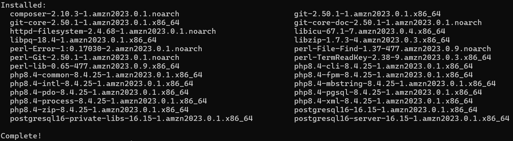

Установка всех необходимых пакетов прошла успешно.

**Вопрос**

- **Почему мы устанавливаем эти пакеты вручную, а не добавляем их в User data?**
  - Пакеты устанавливаются вручную, потому что User data из предыдущей части предназначен для базовой первоначальной настройки сервера. В данной части выполняется настройка окружения непосредственно для PHP-приложения, поэтому его зависимости устанавливаются отдельно. Тем более User data, как было подмечено в задании 2, срабатывает один раз при первом запуске и на данном этапе добавить туда установку этих пакетов в уже живом экземпляре просто невозможно.

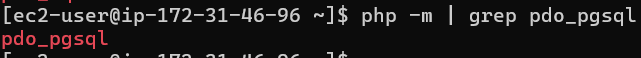

Проверка что PHP видит драйвер pgsql и сможет с ним работать: драйвер отображается, на данном этапе с этим нет никаких проблем.

### Задание 9. База данных PostgreSQL

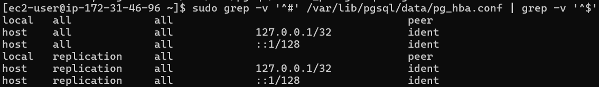

Просмотр кто и как может подключаться к базе данных. Сейчас к БД можно подключиться по методу `indent`, что означает "пускать, только если имя пользователя в Linux совпадает с именем пользователя в базе". Приложение задизайнено так, чтобы подключиться к БД по адресу `localhost` с помощью логина и пароля, поэтому нужно заменить `ident` на `scram-sha-256` (проверка по паролю).

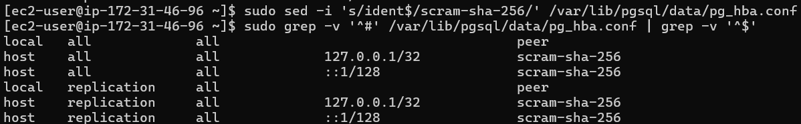

Замена в файле `pg_gba.conf` `ident` на `scram`.

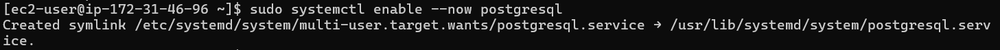

Запуск PostgreSQL и включение автозапуска.

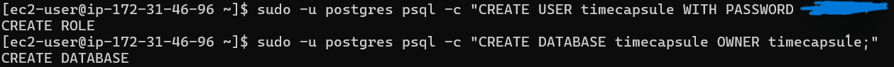

Создание БД и пользователя.

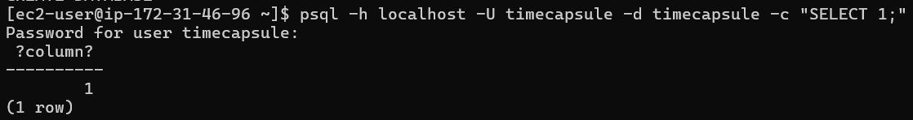

Проверка работоспосности: вернулась таблица с цифрой 1, всё работает.

### Задание 10. Развёртывание кода приложения на сервере

```bash
sudo mkdir -p /var/www/timecapsule
sudo chown ec2-user:ec2-user /var/www/timecapsule
```

Создание папки для приложения и передача прав на владение ею пользователю ec2-user.

```bash
git clone https://github.com/blackrosegarrote-cloud/timecapsule.git /var/www/timecapsule
```

Скачивание кода из созданного репозитория в данную директорию.

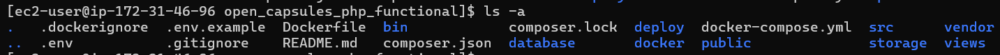

Проверка, что все скачалось: все файлы на месте, можно продолжать.

```bash
nano /var/www/timecapsule/.env
```

Открываем файл `.env` в редакторе nano и вводим туда публичный IP, параметры БД и прочие настройки. Сохраняем изменения (Ctrl+O и Enter) и выходим (Ctrl+X).

```bash
chmod 640 .env
sudo chgrp apache .env
sudo chown -R apache:apache storage
```

Даём право пользователю `apache` читать содержмое `.env`, чтобы PHP-FPM смог работать, а также передаем ему право владеть папкой `storage`.

```bash
composer install --no-dev --optimize-autoloader
```

Скачиние нужных библиотек в папку `vendor`.

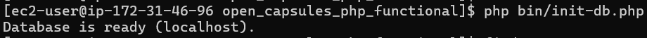

Скрипт init-db.php создал в базе недостающие таблицы и сообщил, что база данных готова.

**Вопросы**

- Почему пароль к базе данных хранится в файле `.env` на сервере, а не в коде в репозитории?
  - Репозиторий публичный, и попавший в код пароль стал бы доступен всему интернету, причём он остался бы в истории git навсегда даже после удаления из кода, а      `.env` на сервере читает только тот, у кого есть доступ к машине и в git он не попадает благодаря `.gitignore`.
- Почему публичный репозиторий безопасен для этого приложения?
  - В репозитории нет секретов: `.env` игнорируется, а сам код не даёт доступа, потому что для подключения к базе нужен пароль, которого в коде нет, база слушает      только localhost и снаружи не доступна, а вход на сервер требует приватный ключ, которого в репозитории так же нет.

### Задание 11. Настройка PHP-FPM и nginx

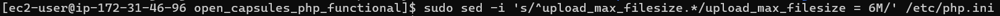

Даём разрешение PHP файлы размером до 6 МБ, чтобы ничего не сломалось, так как по умолчанию лимит PHP составляет 2 МБ, а приложение разрешает вложения до 5 МБ.

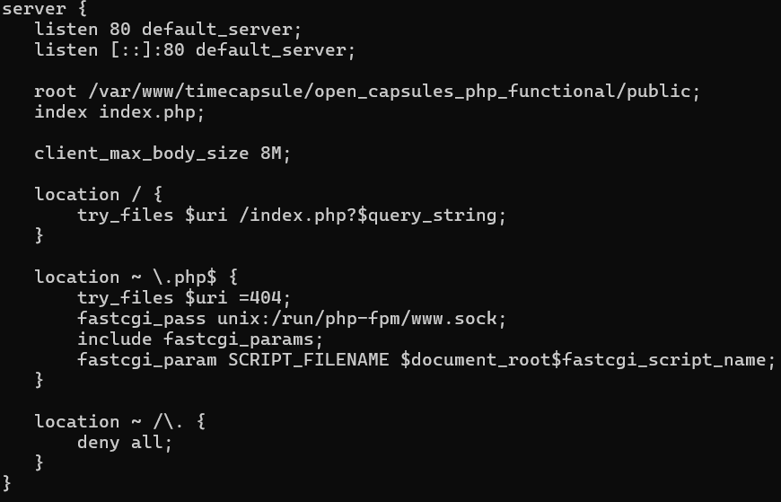

Создание файла конфигурации nginx.

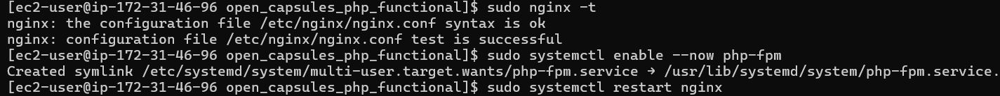

Проверка конфигурации nginx на наличие ошибок и перезапуск nginx для того, чтобы новая конфигурация вступила в силу.

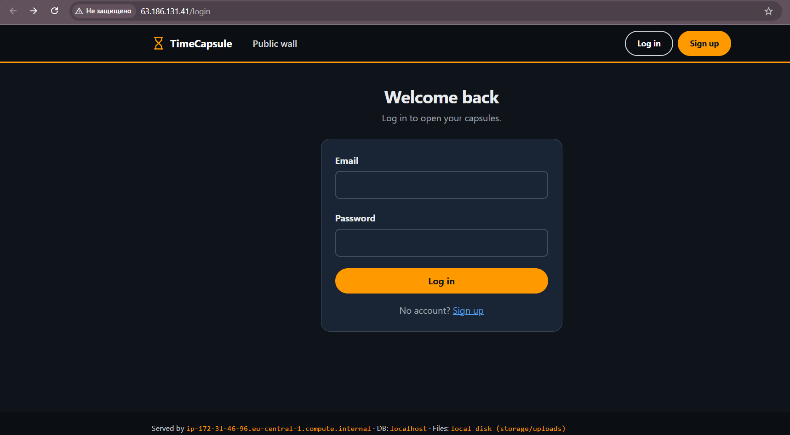

Приложение запустилось, приветственная страница отображается.

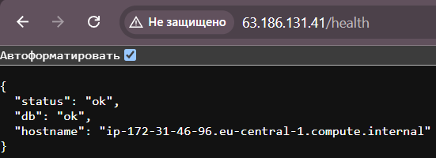

Переход на эндпоинт владки здоровья: все работает корректно.

### Задание 12. Обновление приложения

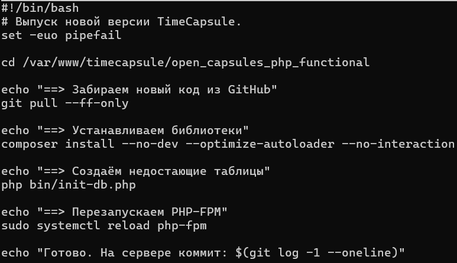

Создание скрипта `deploy.sh`, который будет обновлять версию приложения, опираясь на содержимое GitHub репозитория.

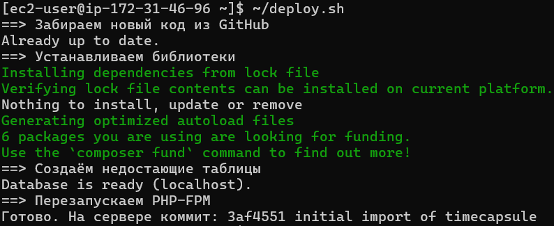

Запуск скрипта, перед этим надо было сделать его исполняемым с помощью `chmod`.

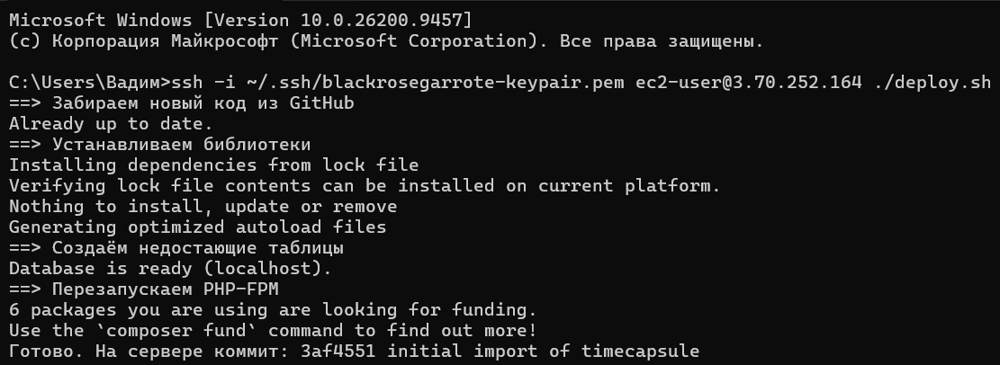

Запуск скрипта с помощью команды `ssh`, позволяет запустить скрипт со своего пк не заходя на сервер.

**Вопросы**

- **git pull заменяет файлы по одному, и это занимает несколько секунд. Что может увидеть посетитель, который откроет сайт в этот момент?**
  - Сайт может показать ошибку или сломаться. `git pull` обновляет файлы последовательно, и в какой-то момент код оказывается в промежуточном состоянии, когда одни файлы уже новые, а другие ещё старые, и приложение падает с фатальной ошибкой, выдавая посетителю 500 Internal Server Error или белый экран.
- **Что случится с сайтом, если после git pull не выполнится composer install?**
  - Если в новом коммите обновились зависимости в `composer.json`, то в `vendor/` их не будет и приложение упадёт с ошибкой "class not found" при попытке использовать новый код, зависящий от отсутствующих библиотек.
  Если зависимости не менялись, то ничего не сломается, но это везение, а не правило, поэтому composer install в скрипте деплоя обязателен для гарантии согласованности кода и зависимостей.

### Задание 13. Новая версия, поломка и откат

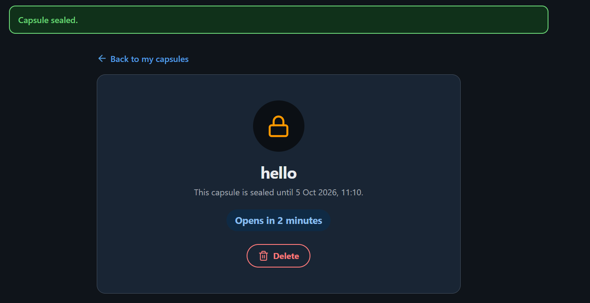

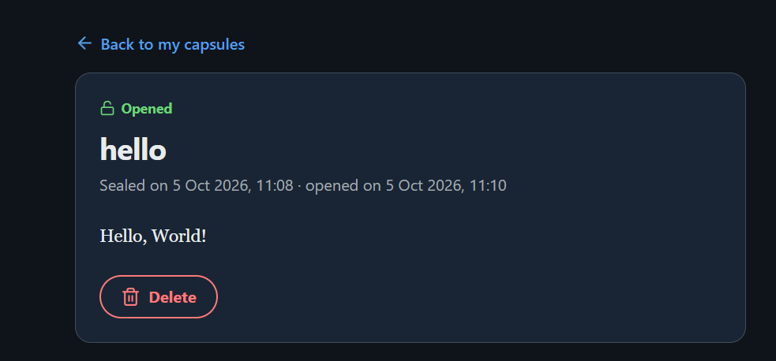

Проверка работоспосности сайта: была создана капсула, а после её открытия было проверено ожидаемое ли у нее содержимое. Проверка прошла успешно, все отработало так, как ожидалось.


Изменение footer'а. Туда был добавлено имя имя студента. Для этого с ПК были загружены изменения на удаленный репозиторий GitHub, а затем изменения были скачаны с помощью скрипта `deploy.sh`. Все отображается, как ожидалось, ошибок нет.

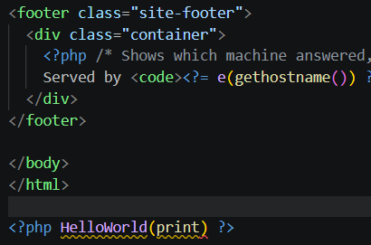

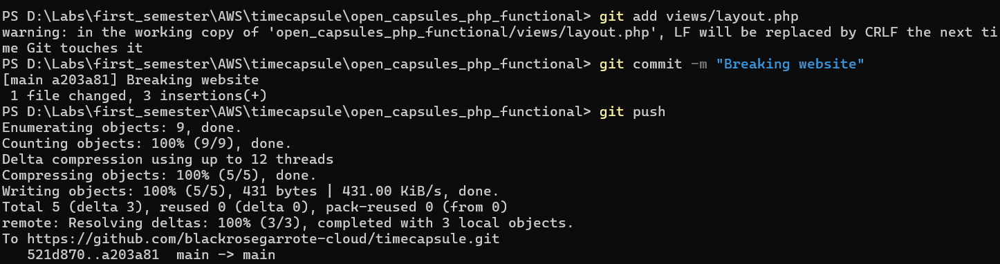

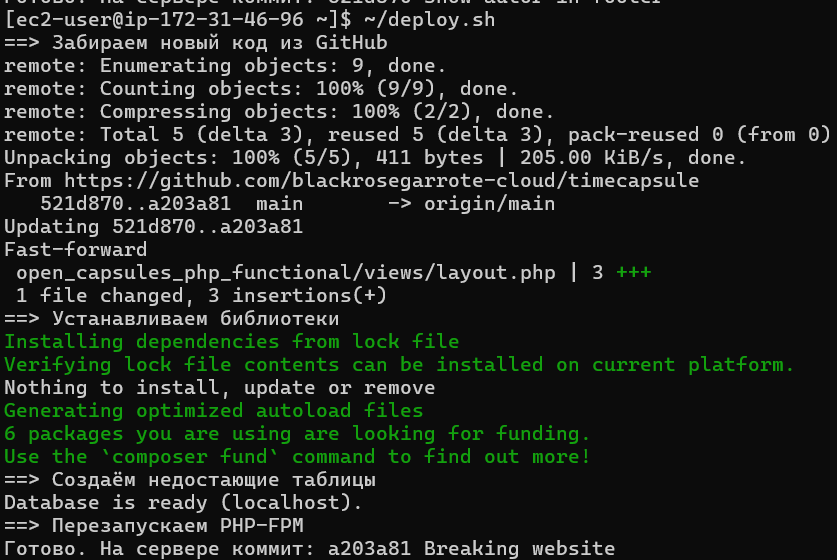

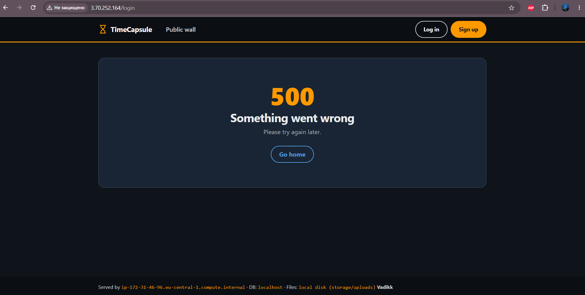

Теперь в файле `lauout.php` была намеренно допущена синтаксическая ошибка. Затем изменения были задеплоены, после этого сайт выдал ошибку 500.

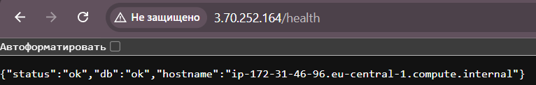

Вкладка health, несмотря на то, что сайт упал, показывает, что все хорошо и нет никаких ошибок.

**Вопросы**

- **Почему /health отвечает ok, хотя главная страница не работает?**
  - Потому что это отдельный обработчик, который проверяет только проверяет доступность БД и наличие таблиц, делая SELECT-запрос к таблице `users`. Он не проверяет остальные слои на наличие ошибок, следовательно для него отсутствие проблем с БД достаточно, чтобы ответить ok.
- **Что на самом деле проверяет этот адрес?**
  - Он проверяет доступность БД и наличие таблиц, выполняя реальный запрос `SELECT COUNT(*) FROM users`, а не пинг соединения, поэтому 500 от него означает либо недоступную БД, либо отсутствие таблиц.
- **Чего не хватает такой проверке?**
  - Ей не хватает проверки остальных слоёв: vendor, шаблонов, роутинга главной и статики, поэтому при сломанной главной health продолжает отвечать ok и даёт ложное спокойствие.

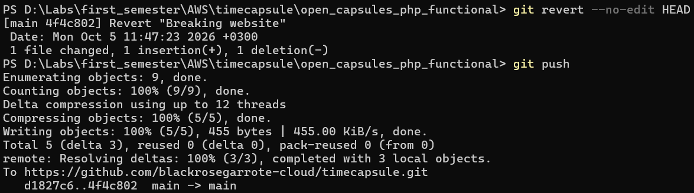

Откат изменений, чтобы сайт снова заработал.

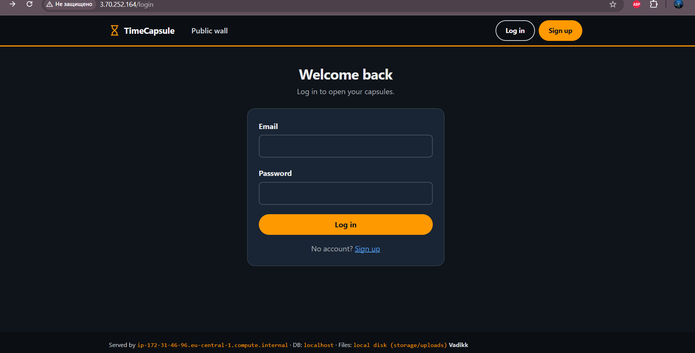

После отката сайт снова заработал.

**Вопросы**

- **Сколько времени сайт был сломан?**
  - Сайт был сломан около 5 минут.
- **Из каких шагов сложилось это время? (сделаем вид, что все сломалось неожиаднно)** 
  1. Обнаружение: переход на главную страницу, вернуося код 500.
  2. Диагностика: выявление проблемы, в данном случае оказлось, что проблема в `layout.php`.
  3. Локальные действия: git revert и git push с рабочей машины машины.
  4. Деплой отката: git pull, composer install и reload php-fpm на сервере - всё это выполняет скрипт `deploy.sh`. Финальная проверка, что сайт снова отвечает, то есть простой длился ровно до конца этого шага.
- **Как можно было бы сократить его?**
  - Мониторинг, который запрашивает главную как обычный посетитель и шлёт алерт при 500, заметил бы поломку за секунды, а не когда человек случайно зайдёт на сайт.
  - CI/CD, который после деплоя прогоняет smoke-тесты и сам откатывает на предыдущий релиз при их падении.

### Задание 14. Архитектура и решение

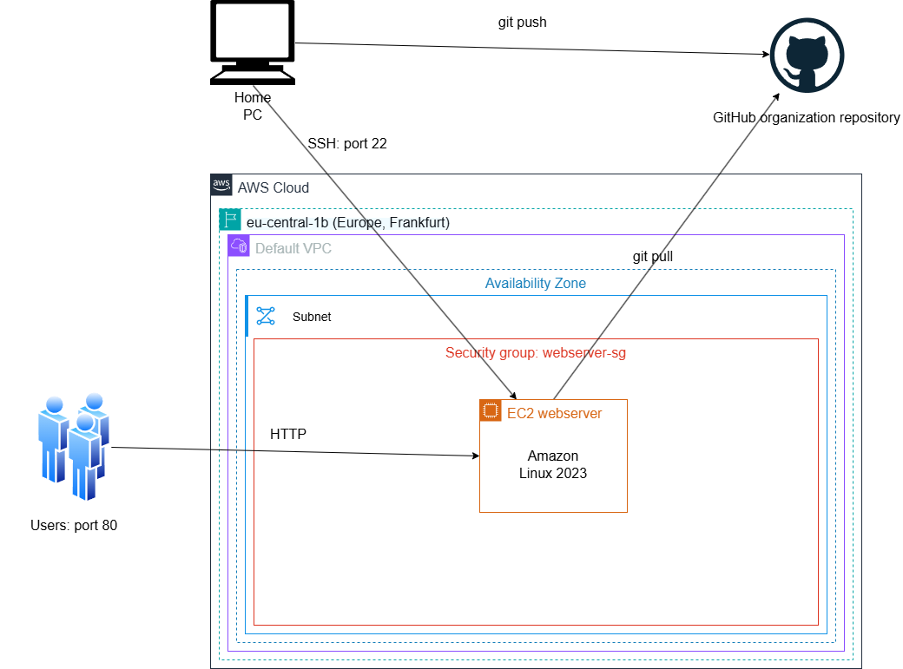

Схема развёртывания приложения по правилам AWS.

### Контрольные вопросы

**1. Как проходит запрос от браузера до базы данных в вашем развёртывании? Какую роль играет каждая программа?**

Браузер отправляет HTTP-запрос на публичный IP экземпляра. Его встечает Security group и решает пускать ли соединение. Затем nginx принимает соединение, отдаёт статику из public/ и передаёт динамические запросы дальше PHP-FPM, где свободный рабочий процесс выполняет PHP-код приложения, который по ходу выполнения обращается к PostgreSQL через драйвер. PostgreSQL читает и пишет данные в своих файлаз на EBS-томе и возвращает результат, после которого PHP отдаёт готовый HTML или JSON  обратно в браузер через nginx.

**2. Почему сервер может скачивать код из репозитория, но не может отправлять в него изменения? Почему для сервера это правильно?**

Репозиторий публичный, так что clone и pull доступны без аутентификации, а push требует учетные данные (SSH-ключ, как в этом приложении) с правом записи. Это правильно по принципу минимальных привилегий и благодаря этому подходу, если злоумышленник получит доступ к серверу, он не сможет запушить вредоносный код на удаленный репозиторий.

**3. Что произойдёт с загруженными пользователями файлами, если удалить экземпляр EC2? Как это связано с тем, что вы знаете об EBS?**

При удалении экзмепляра по умолчанию EBS-том тоже удаяется, следовательно загруженные пользователем файлы исчезнут. EBS-том переживает перезагрузки и остановки, но его жизненный цикл привязан к экземпляру (флаг delete on termination), из чего следует, что данные пользователя существуют, пока сущетсвует экземпляр и будут потеряны, если не сделать предварительно снапшоты.

**4. Что общего у вашего deploy.sh или последовательности команд варианта A с тем, что делают системы CI/CD? Чего в вашем процессе ещё не хватает?**

Общее то, что `deploy.sh` - это по сути пайплайн деплоя: доставка кода, получение кода, установка зависимостей, миграция БД, перезапуск сервис, но CI/CD-выполняет это автоматически. Не хватает автоматического триггера вместо ручного запуска, тестов, автоматического отката при падении тестов и атомарного переключения версий, чтобы не было простоя между `git pull` и `reload php-fpm`.
